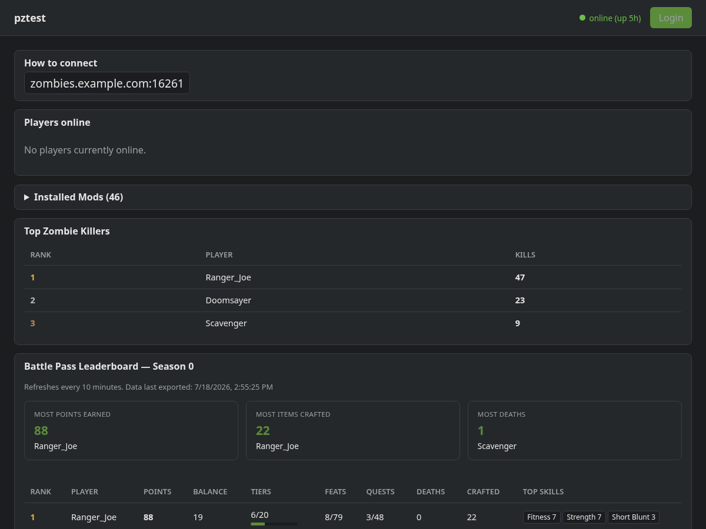
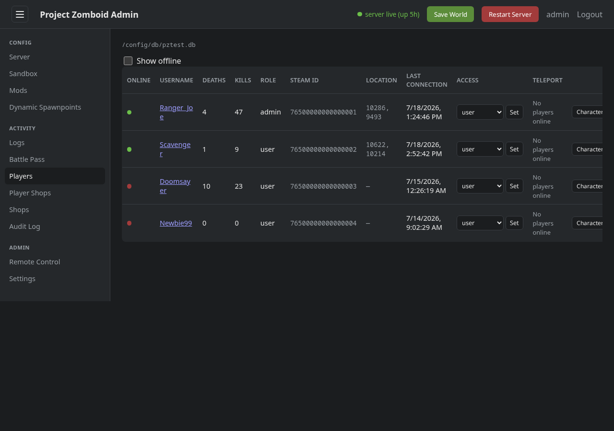
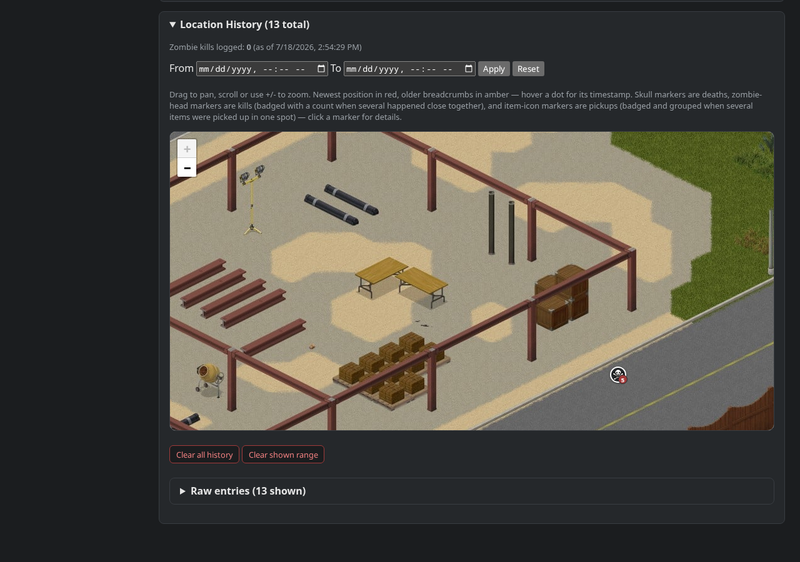
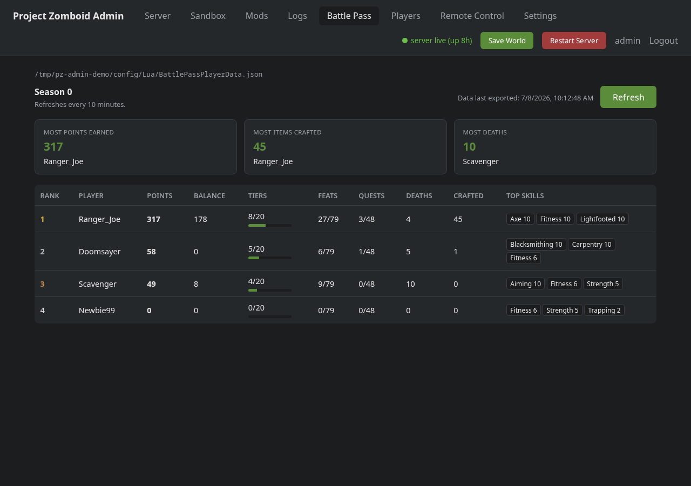
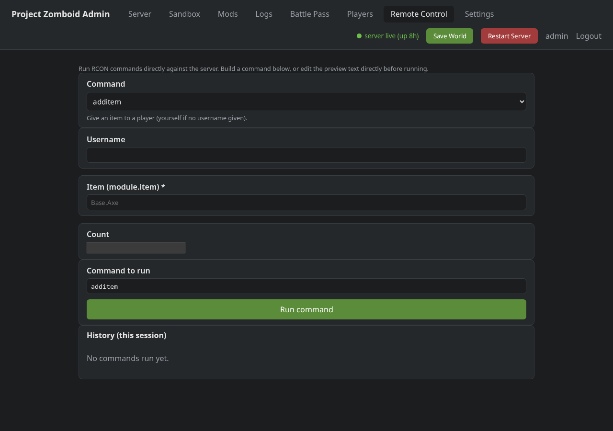
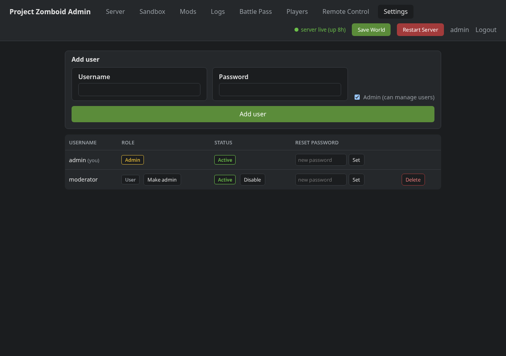
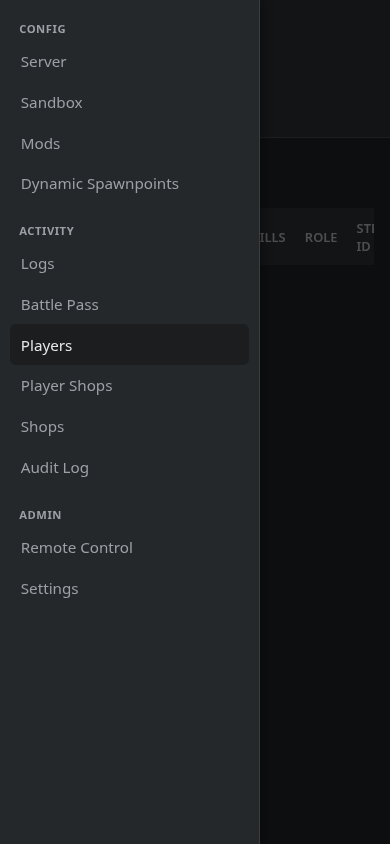

# pz-admin

A FastAPI web app for managing a self-hosted Project Zomboid dedicated server:
edit server/sandbox settings, manage mods (with Steam Workshop URL import),
run a Shops/Player Shops economy, track player locations on an interactive
map with a zombie-kill leaderboard, browse logs and audit history, run
arbitrary RCON commands, manage admin accounts, and restart/save/wipe the
server — all from a collapsible-sidebar, mobile-friendly browser UI.

## Screenshots

**Public dashboard** — the default landing page for logged-out visitors:
server status, connect info, players online, the zombie-kill leaderboard,
and the full Battle Pass leaderboard.

**Players** — registered players with live online status, death/kill counts,
quick access-level changes and teleport-to-player, all sent over RCON.

**Player detail** — per-player breadcrumb map over the live PZ map tiles:
movement trail plus death/kill/item-pickup markers (with item icons) that
cluster together when several events happen close together in time and
space.

**Battle Pass leaderboard** — parsed from the mod's exported player data,
ranked by points earned, with per-player tier/feat/quest progress.

**Remote Control** — a form-driven builder for the full RCON command catalog,
or edit the raw command text directly.

**Settings** — live RCON/connect-address config editor, plus admin user
management (add, disable, promote, reset the password for, or delete admin
accounts). Guards against locking yourself out of the last admin account.

**Mobile** — the 12+ page nav collapses into a hamburger-triggered sidebar
drawer; every page is horizontally-scroll-safe down to phone widths.

## Features

- **Server / Sandbox** — edit `Server/<name>.ini` and `SandboxVars.lua`
  settings through generated forms, grouped into collapsed-by-default
  categories. Named config version snapshots with one-click rollback.
- **Mods** — edit the mod/workshop ID list, with Steam Workshop URL import
  and dependency resolution.
- **Dynamic Spawnpoints** *(toggleable, see below)* — event spawn points,
  plus EventManager trigger zones (radius/cooldown-gated areas that roll a
  zombie spawn across their own spawn points when a player enters).
- **Player breadcrumb map** *(toggleable, see below)* — per-player movement
  history rendered as an interactive Leaflet map over the live game map
  tiles, with distinct death/zombie-kill/item-pickup markers (item icons
  included) that group into one marker+popup when several happen close
  together in time and space. Zombie kill counts surface on the player
  page, the Players table, and a "Top Zombie Killers" leaderboard on both
  the dashboard and Battle Pass page.
- **Shops / Player Shops** *(toggleable, see below)* — an admin-priced item
  catalog (with an item-icon typeahead) and a log of player-to-player
  shop/stall transactions.
- **Logs / Audit Log** — categorized, searchable server logs (user/chat/
  connections/admin/command/debug) and a Battle Pass admin-log sub-tab, plus
  a full audit trail of every admin action taken through this app.
- **Players** — registered (whitelisted) players, live online status via
  RCON, death/kill counts, best-effort character info parsed from the save
  file, inline access-level changes (`setaccesslevel`) and teleport-to-player
  (`teleportplayer`) controls, and an in-line map preview on hover for any
  in-game coordinate shown anywhere in the app.
- **Battle Pass** *(toggleable, see below)* — leaderboard built from the
  mod's `BattlePassPlayerData.json` export: points, balance, tier/feat/quest
  progress, lifetime stats, and top skills per player, plus "most
  points/crafted/deaths" highlights. The same leaderboard is shown on the
  public dashboard.
- **Remote Control** — a searchable, declarative catalog of RCON commands
  rendered as a form (with the right input type per argument), or edit the
  built command text directly before running it.
- **Settings** — a live editor for RCON host/port/password, container/server
  name, and public connect address (applied immediately, no restart);
  per-feature enable/disable toggles for the mod-dependent features above
  (see **Optional features & required mods** below); and admin user
  management: add users, promote/demote admin status, disable/enable
  accounts, reset passwords, delete users. Refuses any action that would
  leave zero active admins.
- **Dashboard** — public, unauthenticated landing page: server status,
  connect address, players online, the zombie-kill leaderboard, and the
  full Battle Pass leaderboard, with a Login button through to the admin
  panel.
- **Server status** — the header badge is RCON-aware: a container the
  Docker daemon reports as "running" still shows **starting up** until RCON
  actually accepts connections, then flips to **server live**.
- **Save / Restart / Wipe** — save the world or restart the container from
  any page; a guarded wipe flow (world data and/or player database) stops
  the server, deletes the selected data, and restarts it.
- **Navigation** — a collapsible left sidebar (grouped, labeled nav links)
  replaces a plain header link row; hidden/shown state persists across page
  loads. Below 880px wide it becomes a hamburger-triggered off-canvas
  drawer, and the rest of the UI (tables, forms, the breadcrumb map) is
  responsive down to phone widths.

## Optional features & required mods

Battle Pass, Shops, Dynamic Spawnpoints, and Player Location Tracking each
depend on a specific optional Workshop mod being installed on the game
server — without it, that mod's data file never gets created and the
feature just has nothing to show. Each one can be toggled off from
**Settings → Optional Features** for a server that doesn't run it, instead
of leaving a permanently-empty-looking tab; toggling is live (no restart)
and doesn't delete any existing data. All four default to **on**.

| Feature | Required Workshop mod(s) |
|---|---|
| Battle Pass | [BattlePass](https://steamcommunity.com/sharedfiles/filedetails/?id=3756808742) |
| Shops *(covers both the Shops and Player Shops tabs — same mod)* | [PlayerShops](https://steamcommunity.com/sharedfiles/filedetails/?id=3749824460) |
| Dynamic Spawnpoints *(covers both the Event Spawns and Trigger Zones sub-tabs)* | [DynamicSpawnPoints](https://steamcommunity.com/sharedfiles/filedetails/?id=3759808711), [EventManager](https://steamcommunity.com/sharedfiles/filedetails/?id=3762284248) |
| Player Location Tracking *(breadcrumb map, zombie-kill counts, Top Zombie Killers leaderboards)* | [PlayerLocationReporter](https://steamcommunity.com/sharedfiles/filedetails/?id=3767193809) |

Settings also shows a live installed/not-installed badge next to each mod
link, checked against the server's own `WorkshopItems` list — so you can
tell at a glance whether a toggle you've enabled actually has its mod
installed.

Server / Sandbox, Mods, Logs, Players, Remote Control, and admin user
management have no mod dependency and are always available.

## Auth

Accounts are stored in a local SQLite database (via
[fastapi-users](https://github.com/fastapi-users/fastapi-users)), with
Argon2-hashed passwords and revocable, database-backed sessions (a cookie
holding an opaque token, not a signed blob — logging out actually deletes
the token server-side).

### First run

There's no signup flow. To bootstrap the first admin account:

1. Copy `users.example.json` to `users.json` and set a real username/password.
2. On first boot, if the auth database is empty, that file is imported once
   (passwords get hashed on the way in) and never read again.
3. Once you can log in, manage all accounts from the **Settings** tab —
   `users.json` is no longer needed and can be deleted.

## Setup

1. Copy `users.example.json` to `users.json` and set real login credentials
   (see **Auth** above).
2. Edit `docker-compose.yml`:
   - Point the `CONFIG_DIR` volume at your real `project-zomboid-config` directory.
   - Set `SESSION_SECRET` to a real random string.
   - Set `RCON_PASSWORD` to your server's RCON password.
   - Set `CONNECT_HOST` to the address players should use to connect.
   - Update the Traefik labels (or remove them) for your own reverse proxy setup.
3. `docker compose up -d --build`

The app expects `PZ_CONTAINER_NAME` (default `projectzomboid`) to be the name
of your running game server container, and mounts `/var/run/docker.sock` so it
can restart it.

### Item icons (optional)

Shops and the breadcrumb map's item-pickup markers look up item display
names/icons from `src/items_index.json` + `src/static/images/`, which
aren't checked into this repo (thousands of extracted game-asset PNGs,
~36MB). Without them the app runs fine — those features just fall back to
the item's raw internal name and no icon. `src/items_index.py` documents
the expected JSON shape if you want to build your own index.
